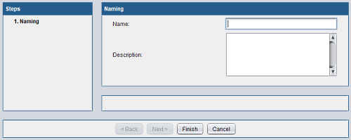

# CycleOP

CycleOP is the main tool developped by Dudesk organization.
The goal is to regroup many java libraries into one project.

## TheiaUI

TheiaUI is a java library to create advanced user-interface objects.

### Example

