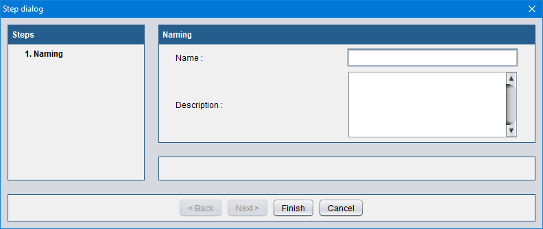

# TheiaUI

TheiaUI is a java library to create advanced user-interface objects.

## Step dialog

TheiaUI allow you to create «Step» dialogs with different type of fields.
You can quickly create dialogs with preconfigurated commons steps like the example below.

### Example

A steps dialog with only one step called "named" that allow to write in a name and a description fields.

```java
// Create a step dialog with a generic name and en empty parent
final StepDialog dialog = new StepDialog("Step dialog", null);

// Add a «Naming» step to the step dialog
dialog.addStep(new NamingStepPanel());

// Show the dialog
dialog.setVisible(true);
```


